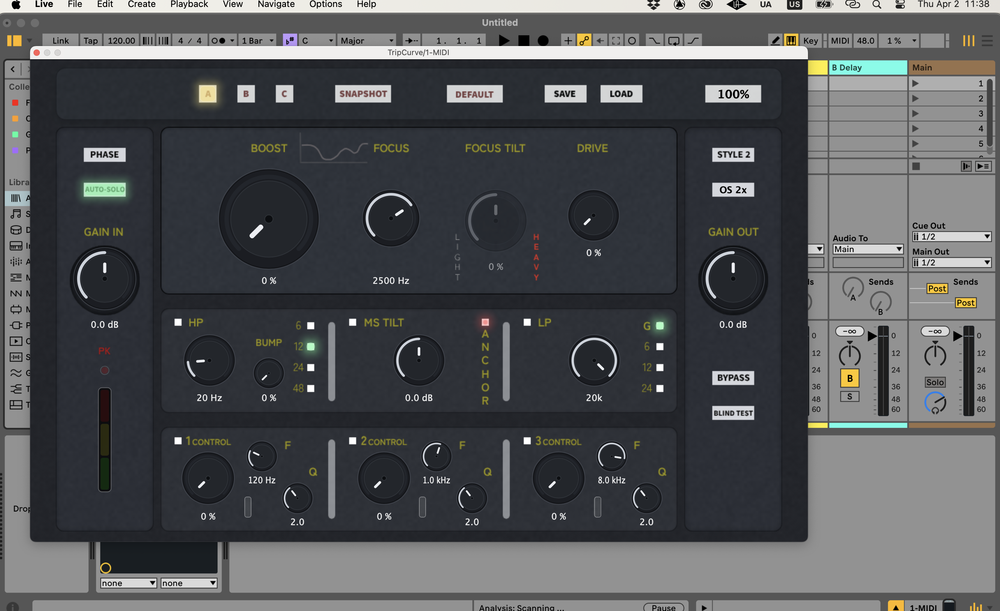

# TripCurve

TripCurve is an audio plug-in project developed in **C++** with **JUCE**, designed for **tonal enhancement in bus processing** and built with a strong focus on **low-latency performance**.

> This repository is a public showcase of the project and does not include the proprietary source code.

## Overview

TripCurve started as a way for me to gain hands-on experience in audio software development and deepen my practical understanding of **C++**, **DSP**, and plug-in architecture.

As development progressed, the project became something more ambitious. Thanks to my long-term background in audio and music production, I naturally moved beyond the idea of building a simple three-band EQ and started shaping a tool around a more specific vision: creating something I felt was missing.

The result is a plug-in concept centered on **tonal enhancement in bus processing**, combining technical experimentation with a practical, ear-driven approach.

## Project Goal

The goal of TripCurve is to create a plug-in specialized in **tonal enhancement for bus processing**.

Rather than approaching processing as a generic EQ or dynamics tool, the idea is to combine multiple stages into a focused workflow that helps shape tone, control balance, and refine the overall character of a bus in a musical and intentional way.

While the plug-in is designed to make something already good sound better, it is also capable of producing meaningful tonal changes with only a few moves, whether on a full mix, a stem, or a raw track.

A central part of the concept is encouraging critical listening. For this reason, the design keeps visual guidance to a minimum and introduces features meant to support more ear-led decision-making during processing.

## Processing Structure

The plug-in is built around **four main stages**:

1. **Gain staging**  
   An initial stage for level management and signal preparation.

2. **Tone enhancement**  
   A fast and original three-band tonal shaping stage built around three main controls, designed to make broad but musical adjustments in a simple and immediate way.

3. **Filtering and tilt mid/side processing**  
   A stage combining filters with mid/side tilt control for more flexible tonal balance and stereo-sensitive shaping.

4. **Three dynamic bands for control**  
   A final stage designed to provide dynamic control across three bands.

## Technical Goals

- Build a responsive audio plug-in architecture in **C++**
- Apply **DSP** concepts in a real-time context
- Design a workflow specifically oriented toward **bus processing**
- Develop an interface that supports fast, intuitive, and ear-led sound decisions
- Improve practical understanding of performance-aware audio software design

## Design Direction

One of the main ideas behind TripCurve is reducing reliance on visual feedback and placing more focus on listening.

The interface is intentionally designed to support fast interaction without overloading the user with unnecessary visual information, while also exploring features that reinforce more objective and perception-based evaluation during the processing workflow.

## Stack

- **C++**
- **JUCE**
- **CMake**
- **Git / GitHub**

## Architecture Overview

The project is structured around three main areas:

- **audio processing logic**
- **parameter and state management**
- **graphical user interface**

This separation helps keep the project modular, easier to maintain, and easier to expand as the concept evolves.

## Screenshot

## Notes

The source code is intentionally kept private at this stage.

This repository is meant to present the project’s concept, structure, and technical direction as part of my software and audio development portfolio.

## Author

**Gianluca Zanin**  
Software engineering student at 42 Berlin, with a strong interest in audio software, C++, DSP, and creative technology.
